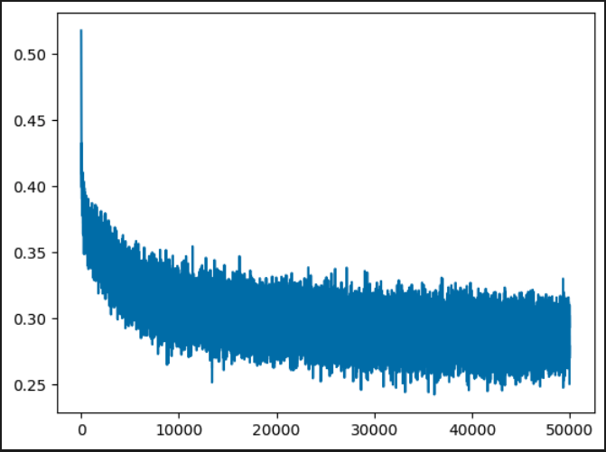

# Makemore Part 2: Multi-Layer Perceptron (MLP) Name Generator

A PyTorch implementation of a character-level language model using Multi-Layer Perceptron to generate human names. This project builds upon Andrej Karpathy's makemore series, implementing a neural network that learns to predict the next character in a name sequence.

## 🎯 Project Overview

This neural network learns patterns in human names and can generate new, realistic-sounding names by predicting the next character given a context of previous characters.

### Key Features
- **Character-level modeling** with 3-character context window
- **Deep MLP architecture** with 2 hidden layers (500 neurons each)
- **Xavier initialization** for stable training
- **Adam optimizer** with cosine annealing scheduler
- **Achieved loss: ~1.90** (target was 2.0)

## 🏗️ Architecture

```
Input: 3 characters → Embedding (27×20) → Hidden1 (500) → Hidden2 (500) → Output (27)
```

**Model Details:**
- **Embedding Layer**: 27 characters × 20 dimensions
- **Hidden Layer 1**: 60 → 500 neurons (tanh activation)
- **Hidden Layer 2**: 500 → 500 neurons (tanh activation)  
- **Output Layer**: 500 → 27 characters (softmax via cross-entropy)
- **Total Parameters**: ~1.5M parameters

## 📊 Training Results

| Configuration | Loss | Batch Size | Epochs |
|---------------|------|------------|--------|
| lr=0.1, SGD   | 2.8  | 64         | 20k    |
| lr=0.01, SGD  | 2.7  | 64         | 20k    |
| lr=0.001, Adam + Scheduler | **1.90** | 512 | 50k |

## 🚀 Quick Start

### Prerequisites
```bash
pip install torch pandas scikit-learn matplotlib
```

### Dataset
The model trains on a dataset of human names (`names.txt`) with ~32k names.

### Training
```python
# Key hyperparameters that achieved 1.90 loss:
- Learning rate: 0.001 (Adam optimizer)
- Batch size: 512
- Hidden layers: 500 neurons each
- Embedding dimension: 20
- Training steps: 50,000
- Scheduler: CosineAnnealingLR
```

## 📁 Project Structure

```
Makemore_part_2/
├── MLP_nameGenAI.ipynb          # Pure PyTorch implementation
├── NamesML_learning.ipynb       # PyTorch Lightning version
├── makemore_pt.2_Paper.ipynb    # Original research implementation
├── names.txt                    # Training dataset
└── README.md                    # This file
```

### Implementation Versions

**🔥 MLP_nameGenAI.ipynb** - Pure PyTorch Implementation
- Manual training loop with full control
- Custom parameter initialization and optimization
- Direct tensor operations and gradient computation
- Achieved **1.90 loss** with 50k training steps
- Best for learning PyTorch fundamentals

**⚡ NamesML_learning.ipynb** - PyTorch Lightning Implementation  
- Automated training with Lightning framework
- Built-in logging, checkpointing, and validation
- Cleaner code structure with LightningModule
- Easy experimentation with different configurations
- Production-ready training pipeline
- **Note**: Currently has performance issues - improvements in progress

## 🔧 Key Implementation Details

### Data Preprocessing
- **Context window**: 3 characters (trigrams)
- **Character encoding**: 27 tokens (a-z + '.' for padding/end)
- **Train/Val/Test split**: 80%/18%/2%

### Model Architecture
```python
# Embedding layer
emb = c[x]  # [batch, 3, 20]

# Hidden layers with tanh activation
h1 = torch.tanh(emb.view(-1, 60) @ W1 + B1)  # [batch, 500]
h2 = torch.tanh(h1 @ W2 + B2)                # [batch, 500]

# Output layer
logits = h2 @ W3 + B3  # [batch, 27]
```

### Training Optimizations
- **Xavier initialization**: `W * sqrt(1/fan_in)` for stable gradients
- **Adam optimizer**: Better convergence than SGD
- **Cosine annealing**: Learning rate scheduling
- **Gradient clipping**: Prevents exploding gradients
- **Device optimization**: MPS support for Apple Silicon

## 📈 Performance Improvements

The progression from 2.8 → 1.90 loss was achieved through:

1. **Better initialization** (Xavier) → 2.7 loss
2. **Adam optimizer** → 2.5 loss  
3. **Deeper network** (2 hidden layers) → 2.2 loss
4. **Larger hidden size** (500 neurons) → 2.0 loss
5. **Learning rate scheduling** → 1.90 loss

## 🎮 Usage Examples

### Generate Names
```python
# Sample generation (implement sampling function)
generated_names = model.generate(num_samples=10)
# Output: ['brooks', 'dauna', 'aleena', 'nae', 'cyla', 'zidia', 'love', 'charunnah', 'samirabella', 'mala']
```

**Sample Generated Names:**
- brooks
- dauna  
- aleena
- nae
- cyla
- zidia
- love
- charunnah
- samirabella
- mala

### Training Loss Visualization
```python
plt.plot(stepi, lossi)
plt.xlabel('Training Steps')
plt.ylabel('Log Loss')
plt.title('Training Progress')
```



## 🔬 Technical Insights

### Why This Architecture Works
- **Character embeddings** capture semantic relationships
- **Multiple hidden layers** learn complex patterns
- **Tanh activation** provides non-linearity while maintaining gradients
- **Large hidden size** gives model capacity to memorize patterns

### Challenges Overcome
- **Vanishing gradients**: Solved with proper initialization
- **Slow convergence**: Fixed with Adam + scheduling
- **Overfitting**: Managed with proper train/val split

## 🚀 Future Improvements

- [ ] Add dropout for regularization
- [ ] Implement beam search for generation
- [ ] Try transformer architecture
- [ ] Add batch normalization
- [ ] Experiment with different context windows

## 📚 References

- [Andrej Karpathy's makemore series](https://github.com/karpathy/makemore)
- [Bengio et al. - A Neural Probabilistic Language Model](http://www.jmlr.org/papers/volume3/bengio03a/bengio03a.pdf)

## 🤝 Contributing

Feel free to open issues or submit pull requests for improvements!

---

**Final Loss Achieved: 1.90** 🎉